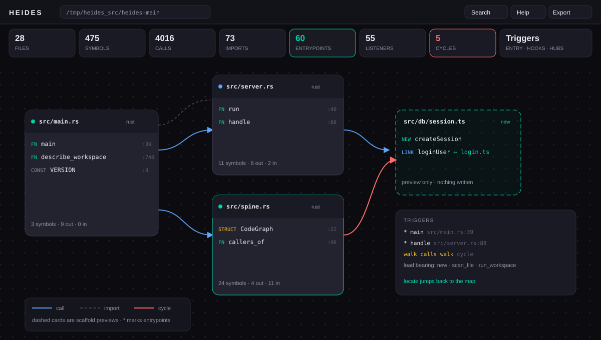

# HEIDES

## The code nervous system

HEIDES is a deterministic harness that gives AI coding agents what they do not have on their own. Senses, memory and judgment for code. Before an agent touches anything, HEIDES maps the entire codebase into a persistent graph, derives warnings and edge cases from that map, and grounds every plan against reality. The agent suggests. HEIDES decides what is safe.

HEIDES does not compete with agents. It is the substrate beneath them. One binary, no cloud, no model required for the core. It runs on a laptop, a server, a CI runner, and a phone running Termux.

## Why it exists

An AI agent is powerful and blind. It can generate a perfect function and still break three callers it never saw, because it has no persistent map of the code. Linters and tests catch that damage after it lands, and only on paths that actually run. The classic failure. An agent changes a signature, unexercised call sites break, the test suite stays green, and production breaks at two in the morning.

HEIDES closes that gap at the moment that matters, before the patch is applied. It answers questions no tool answers in that instant. Who calls this function? Which imports does this file really use? Does this change conflict with the current graph? Is user input flowing into a SQL string, a shell, or a prompt?

## Architecture

HEIDES is three organs over one spine, all deterministic, all local, all explainable.

### The Spine

Perception and memory. The Spine walks the codebase and builds a compact persistent graph of symbols, files, callers, callees, imports, signatures, docs, constants, fields and enum variants, with module level code first class. The index lives in a sqlite database at .heides/index.db in the workspace and is updated incrementally as files change. Every later query, from Harmony guards to Grounding plans to the agent itself, reads the same map. No model is involved. This layer is pure analysis.

The graph answers these questions directly.

* Who calls this symbol?
* Who imports this module?
* Where is this symbol defined?
* What does this function call?
* What does this file talk to?
* What is this symbol for, from its own doc comment?

One command, describe, prints the whole map as a workspace manifest. Entrypoints, files that run module level code, the most connected symbols, call cycles and which files talk to which. An agent reads the manifest and the neighbors of one symbol instead of walking the tree, kilobytes instead of megabytes. One command, export, writes the entire map to a single file, every file sheet with its symbols, signatures, docs and edges, plus a presence ledger that lists every file the walker saw even when it was not parsed, so nothing in a codebase is ever invisible.

### Harmony

Judgment. Harmony runs the guard modules against the Spine graph and against proposed patches. Every guard is deterministic and reports evidence, never guesses.

* Staged apply. Compares current code against proposed code and blocks conflicts before anything is written to disk.
* Edge cases. Flags missing null, empty, error path and boundary handling on every changed function.
* Security taint. Traces user input into SQL, shell, filesystem and prompt sinks, and through the mark_safe framework sink into rendered output.
* Dependency. Detects upgrades that break the imports this project actually uses.
* Practices. Surfaces violations of project conventions.

Warnings are delivered the way a senior reviewer would deliver them. A file, a line, a severity, and the reason.

Here is what a finding looks like.

    [critical] user controlled input reaches a SQL sink on this line. source at line 3 (security.taint) at app.js:12

### Grounding

Refinement. Grounding takes an objective or a plan and checks it against the Spine and against the outside world. It confirms feasibility, surfaces missing prerequisites, and returns a bounded specification that the agent then builds against. For new projects it turns a plan into a scaffold, indexes the newborn workspace immediately so it reads back through the same map, and hands a clean foundation back to the agent. For facts that change over time it can consult the web and update its own knowledge.

## How it works

HEIDES is event driven. It wakes when a session starts or a file changes, works, and sleeps when the job is done. Nothing is stale because everything recomputes on demand against the persistent index.

1. The agent or user summons HEIDES before any change.
2. The Spine maps the codebase and saves the index.
3. Harmony derives warnings, edge cases and security notes from the map.
4. The user states the objective. Grounding refines it. This is not feasible as stated, it needs these pieces, this variant is sound.
5. The agent builds against the grounded spec while HEIDES guards every proposed patch.
6. The job ends. HEIDES goes dormant until the next trigger.

## How the guards work

* Staged apply. An agent proposes a patch that changes add(a, b) into add(a, b, c). HEIDES applies the patch in memory, parses the changed file again, compares signatures against the spine, finds that main still calls add with two arguments, and reports a blocker with the exact call site. Nothing has been written to disk.
* Security taint. A line assigns from req.query. A later line passes that variable into db.query. HEIDES reports the sink line and names the source line. SQL, shell, filesystem and prompt injection sinks are covered across every deep language. Django mark_safe is the single framework sink, user content that reaches it reports critical with the source line named.
* Edge cases. unwrap calls, JSON.parse without try, bare except blocks, mutable python defaults and unguarded storage reads are flagged with a severity.
* Best practices. Leftover debug output, unfinished markers, hardcoded secrets and overlong functions are reported as info or warnings.
* Dependencies. Manifests are read, every pinned package is checked against the OSV vulnerability database, and the latest published version is fetched for comparison.

## Connectivity

One core, every shell. The same binary speaks to everything.

* CLI. Native commands are scan, status, query, describe, export, check, staged, plan, scaffold, deps, watch, mcp and version. Query reads callers, imports, definition, calls, neighbors and search for one symbol or phrase. Describe prints the workspace manifest in one read. Export writes the whole map as one file.
* MCP. A Model Context Protocol server over stdio. Any MCP aware agent, editor or harness attaches directly. Also listed in the official MCP registry as io.github.AbduljabbarBXR/heides, installable by name from registry aware clients.
* Agent systems. Claude Code, Codex, Cursor, OpenCode, Hermes and custom builds via MCP.
* Skills. HEIDES exposes its capabilities as MCP tools and resources, so skill systems can compose it.
* VS Code. Native MCP support in VS Code attaches to the same server. An extension is planned.
* Mobile. The same static binary runs on Android Termux and other Unix systems.

No ports, no daemon protocol, no cloud account. Just one process on stdio.

## MCP tool reference

The server exposes eleven tools.

* spine.scan. Map the current codebase into the persistent spine index.
* spine.query. Ask who calls a symbol, who imports a module, where a definition lives, what a function calls, or search names, signatures and docs as free text.
* spine.describe. Read the whole workspace manifest in one call, languages, symbol counts, entrypoints, hubs and doc coverage per language.
* spine.neighbors. Show every side of a symbol, its definition with the captured doc, its callers and the calls it makes out.
* harmony.check. Run every guard on the workspace and return findings with evidence.
* harmony.report. Run every guard and return the verdict as structured JSON with severity counts.
* harmony.staged. Check a unified diff before applying it. Blocks conflicts and signature breaks.
* grounding.plan. Evaluate a plan against the codebase. Confirms symbols, flags missing ones, checks paths.
* grounding.scaffold. Scaffold a new project from a plan and index it immediately.
* deps.check. Check dependencies for known vulnerabilities and outdated versions.
* web.confirm. Confirm a fact against the package registries on the web.

## Security model

* Deterministic by design. Findings carry a file, a line and a reason. No black boxes.
* Local by default. Nothing leaves the machine except explicit web calls for dependency checks and grounding.
* No telemetry, no analytics, no account.
* One static binary, no runtime dependencies.

## Use cases

* Guardrail for agentic coding sessions in the terminal.
* Pre merge review for AI generated pull requests.
* Onboarding a new agent to an unfamiliar codebase.
* Security review of agent applications, especially prompt injection.
* Dependency hygiene for older projects.

## Install

One line installer, downloads the prebuilt binary for your platform, linux, macos, windows and Termux Android.

    curl -fsSL https://raw.githubusercontent.com/AbduljabbarBXR/heides/main/scripts/install.sh | bash

Pin a version with HEIDES_VERSION.

    HEIDES_VERSION=0.6.0 curl -fsSL https://raw.githubusercontent.com/AbduljabbarBXR/heides/main/scripts/install.sh | bash

Or install the `heides` command from npm (no Rust toolchain needed):

    npm install -g heides
    heides --help

Or build from source with a Rust toolchain, or take a prebuilt binary from the releases page.

    git clone git@github.com:AbduljabbarBXR/heides.git
    cd heides
    cargo build
    cp target/debug/heides ~/.local/bin/heides

## Quick start

    cd your_project
    heides scan

The Spine maps the codebase and saves the index under `.heides`.

    heides status

Shows the state of the index.

    heides query callers send_order

Asks the graph who calls a symbol, who imports a module, where a definition
lives, and what a function calls.

    heides check

Runs every guard against the workspace and prints findings with a file, a
line, a severity, and the reason.

    heides staged patch.diff

Checks an agent proposed diff before anything is applied. Signature changes,
removed symbols, duplicate definitions and deleted files are blocked with the
exact call sites that would break.

    heides plan "refactor the checkout_flow"

Grounds an objective against the spine. Confirmed symbols, missing symbols
and path facts come back before the agent starts.

    heides scaffold "rust cli tool" my_app

Turns a plan into a starter project and indexes it immediately.

    heides deps

Checks dependencies against the OSV vulnerability database and the latest
published versions.

    heides watch

Stays alive and reindexes on demand as files change.

    heides mcp

Starts the MCP server on stdio. Point any MCP client at it.

Example VS Code settings fragment.

    {
      "mcp": {
        "servers": {
          "heides": {
            "command": "heides",
            "args": ["mcp"]
          }
        }
      }
    }

## Setup for agents

HEIDES is designed to sit in front of any agent. The same binary serves every surface, one static file on PATH as heides.

MCP clients. Claude Code and Cursor read a .mcp.json at the repo root.

    {
      "mcpServers": {
        "heides": {
          "command": "heides",
          "args": ["mcp"]
        }
      }
    }

Hermes registers the server once.

    hermes mcp add heides --command heides --args mcp

Opencode reads the mcp block in opencode.json.

    {
      "mcp": {
        "heides": {
          "type": "local",
          "command": ["heides", "mcp"],
          "enabled": true
        }
      }
    }

The server exposes the spine and harmony tools, spine.scan, spine.query, harmony.check, grounding.plan, so the agent sees the code graph as tools instead of guessing.

Agent gate files. Add AGENTS.md to the repo so every agent knows the rule.

    # Edit rules
    Before applying any change run heides staged on the diff.
    Push only when heides staged says safe and heides check shows no blocker.

CLI summon. heides and sum point at the same binary. sum is the summon word, scan once then gate every patch.

Hermes sessions. The skill named heides teaches the session when to summon, and the Hermes memory entry points at it. A session that is about to edit code runs heides staged on its own diff before apply, the same discipline the harness enforces on every other agent.

## Design principles

* Deterministic first. A rule that is provable beats a model that is plausible. Models are reserved for the parts that need them.
* Explainable always. Every warning carries a file, a line and a reason. No black boxes.
* Local and small. One binary, a compact sqlite index, low memory. No cloud dependency, no telemetry by default.
* Model agnostic. HEIDES does not care which model drives the agent. It guards the code, not the model.
* Agent agnostic. Any tool that can run a process and read stdio can use it.
* Alive, not stale. Event driven wakeups, incremental index updates, on demand recompute.

## Project status

Every change lands behind the same gate, lint, build, the unit suite, the hostility suite, the serial battle suite of seventy seven end to end checks and the byte identical determinism test, all run against a real fixture workspace, including MCP round trips, taint scenarios in every deep language, cross function and module level taint chains, a scale phase and a hostile phase. The scale phase generates a synthetic workspace of about one hundred thousand lines, plants known bugs, and asserts the scan time budget, the memory budget and the exact finding counts, then proves the incremental diff on the same tree. The hostility suite feeds random bytes, code soup, truncated real code and brace storms to the parser and every guard in every language, and asserts no panic, no crash and no hang. A clean corpus gate asserts zero findings on idiomatic code in every supported language, so a rule that fires on clean code fails the build. The determinism test scans the same tree twice from a clean index and asserts byte identical stdout and an identical sqlite store. The same gate runs on GitHub Actions for every push and pull request.

Measured on a phone running Termux. A synthetic workspace of 101622 lines across 2400 files scans in 1.6 seconds and indexes in 0.95 megabytes, about 9.6 bytes per line of code. Peak memory during the fresh scan is 16 megabytes. A query over the full graph answers in 39 milliseconds. Changing a single file rescans in 82 milliseconds and touches exactly one file. These are the numbers from the release binary on an Android device, so desktop and server builds are at least as fast.

## Dashboard (planned)

A local code intelligence dashboard is planned, but is not implemented or included in the current release.

## FAQ

* Which models does HEIDES need? None. The core is pure analysis. The agent that consumes it can be any model.
* Does HEIDES send code anywhere? Only the dependency and web grounding tools make network calls, and only package names and versions.
* How is HEIDES different from a linter? Linters check syntax and style of the current file. HEIDES checks proposed changes against the whole graph of callers and imports before apply.
* Can I use it with my editor? Yes. Point any MCP aware client at heides mcp. VS Code supports MCP natively.

## Contributing

Contributions are welcome. Read the CONTRIBUTING file before opening a pull request. The project is open to issues, pull requests and discussion.

## Development

    cargo build
    cargo test
    cargo run scan
    cargo run mcp

The codebase is small on purpose. Each organ lives in its own module and exposes a plain interface so the project stays understandable as it grows.

## License

MIT. See the LICENSE file.

## Compatibility

Model agnostic is the design, not a slogan. HEIDES guards the code, never the model. Whatever drives the agent, frontier API, open weights, local, it speaks MCP or runs the CLI and the same binary gates the same way. The logos below are the front doors, the harness itself has no model dependency at all.

One static binary with no runtime dependencies runs on every platform HEIDES claims, desktop, server, CI and phone. The Android build runs under Termux on the same filesystem as the desktop builds, byte for byte the same analysis.

Deep analysis, taint, dataflow and the call graph, targets eight languages. Rust, JavaScript, TypeScript, Python, PHP, Go, Java and C#. Every language in the deep set gets the same symbols, signatures, call edges, parameter names and interprocedural taint summaries, so the guarantees do not change when the language does. HTML and CSS joined the map as web surface languages, pages contribute import edges for their scripts and stylesheets and inline script bodies are parsed as real javascript, while the deep guarantee set stays with the eight.

Structural analysis for everything else is on the roadmap, together with Ruby, Kotlin, Swift and Shell in the deep set. AI system files are first class, agent configs, MCP server manifests, prompt files, notebooks and dependency manifests are modeled as their own file kinds.

